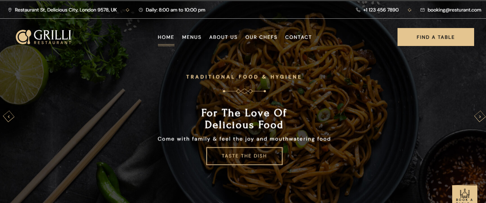

# 📌 GRILLI - AMAZING & DELICIOUS FOOD
Grilli is a modern and responsive restaurant website built with HTML, CSS, and JavaScript. It showcases a stylish homepage, menu section, reservation form, and more—ideal for restaurant or food-related businesses.

## 🌟 Features
- Responsive design for all screen sizes
- Interactive navigation menu
- Smooth scrolling and animations
- Menu section with food categories

## 🛠 Tech Stack
- HTML5
- CSS3
- JavaScript

## 🚀 Getting Started
To run this project locally:
1. Clone the repository
   `git clone  https://github.com/estheroluwabuyi/Grilli-Website.git`
2. Navigate into the project folder
   `cd Grilli-Website`
3. Open index.html in your browser

## 📷 Screenshots

## ✨ Live Demo
(https://grilli-restaurant-thecodegal.netlify.app/)
